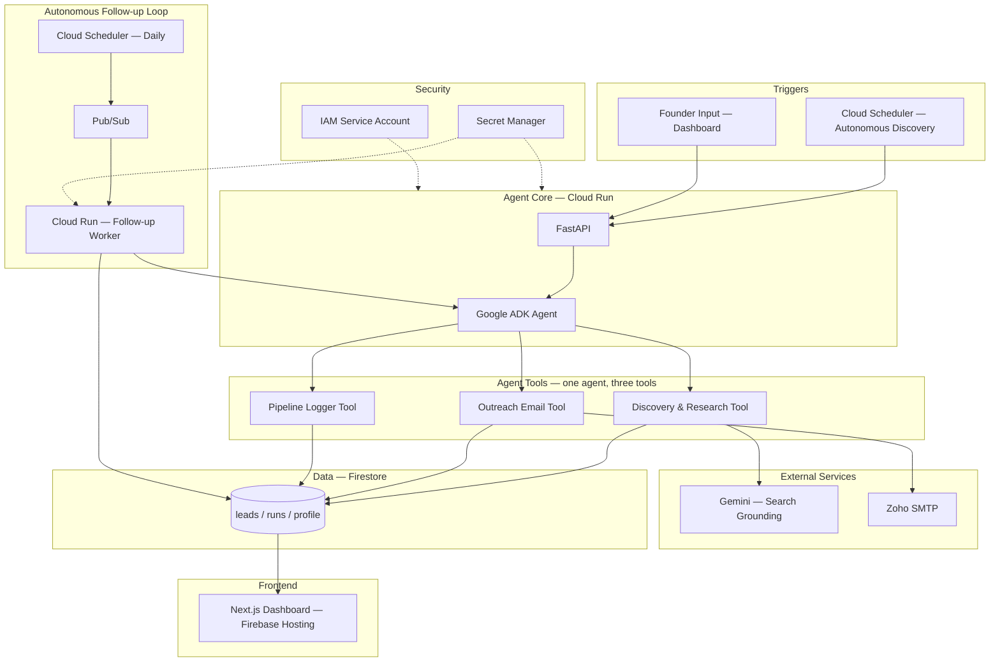

# Architecture — ConvoSatya Lead & Opportunity Agent

This document describes the system architecture for the ConvoSatya Lead &
Opportunity Agent. See [SCOPE.md](./SCOPE.md) for the full functional flow
and [Techstack.md](./Techstack.md) for the complete technology breakdown.

## System Architecture

One Google ADK agent, three tools, triggered either by a schedule or a
loose founder instruction — never by manually creating a lead.

**How to read this:**

- **Triggers** — both entry points (the clock, or the founder) land on the
  same FastAPI endpoint.
- **Agent Core** — FastAPI receives the request and hands it to a single
  ADK agent. There is no multi-agent orchestration in this system.
- **Agent Tools** — three tools belonging to that one agent, not separate
  agents: Discovery & Research, Outreach Email, and Pipeline Logger.
- **External Services** — Gemini (search grounding) and Zoho SMTP are
  called by the tools but are not part of ConvoSatya's own infrastructure.
- **Data** — Firestore is the single source of truth. All three tools
  write to it; the dashboard only ever reads from it.
- **Autonomous Follow-up Loop** — runs on its own schedule, independent of
  any human action, and loops back into the same agent core days later.
  This is the core proof of "no human intervention."
- **Security** — dotted lines indicate a permissions relationship, not
  data flow: Secret Manager and IAM apply underneath the Agent Core and
  the Follow-up Worker.

## Sequence Diagram

> Coming soon — will show the step-by-step discovery-to-outreach flow
> (matching the 14 steps in SCOPE.md) as a Mermaid sequence diagram, to
> make the "zero human intervention" chain traceable step by step.

## Firestore Schema

> Coming soon — detailed field-level schema for the `leads`, `runs`, and
> `profile` collections.
