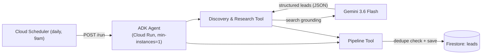
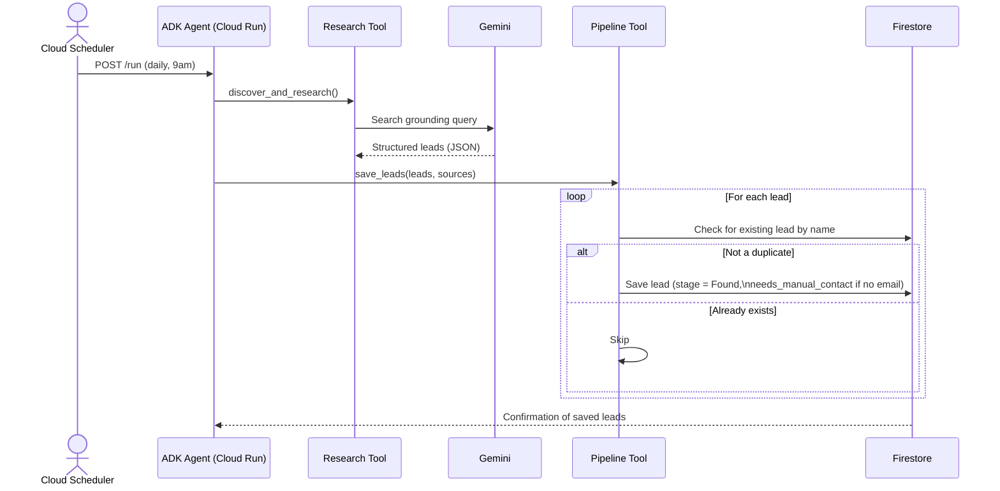

# Architecture — ConvoSatya Lead & Opportunity Agent

This document describes the system architecture for the ConvoSatya Lead &
Opportunity Agent. See [SCOPE.md](./SCOPE.md) for the full functional flow
and [Techstack.md](./Techstack.md) for the complete technology breakdown.

## System Architecture

One Google ADK agent, two tools, triggered by Cloud Scheduler on a daily
cycle (or a direct API call) — never by manually creating a lead.

**How to read this:**

- **Trigger** — Cloud Scheduler fires once daily against the deployed
  Cloud Run service's `/run` endpoint. No human is involved.
- **Agent Core** — a single ADK agent (`root_agent`), deployed via
  `adk deploy cloud_run`, kept warm with `min-instances=1` so its session
  state survives between scheduled runs.
- **Discovery & Research Tool** — calls Gemini with Google Search
  grounding, requesting a structured JSON list of leads (not free text).
- **Pipeline Tool** — checks Firestore for an existing lead with the same
  name before saving, so repeated daily runs don't create duplicates.
- **Firestore** — the single source of truth; every saved lead includes
  its category, relevance reasoning, sources, and a `needs_manual_contact`
  flag for the founder to follow up on directly.

Authentication throughout uses Application Default Credentials via the
Cloud Run service account — there are no API keys anywhere in this
system.

## Sequence Diagram

This shows one full discovery-to-outreach cycle, step by step. The same
component names from the System Architecture diagram are reused here for
consistency.

**Why this diagram matters for judging:** there is no human participant
anywhere in this chain. `Cloud Scheduler` only *starts* the cycle — every
arrow after that is agent-to-tool or tool-to-service, ending with new,
deduplicated leads sitting in Firestore with zero human involvement.

## Firestore Schema

Three collections. `leads` and `runs` grow over time; `profile` is a
single document describing ConvoSatya itself.

### `leads` — one document per opportunity

| Field | Type | Purpose |
|---|---|---|
| `name` | string | Who or what this lead is |
| `category` | string | investor / accelerator / hackathon / event / demo_night / startup_program |
| `stage` | string | Found -> Contacted -> Replied -> Meeting |
| `relevance_note` | string | Gemini's reasoning for why this is a good match |
| `sources` | array\<string\> | URLs used during research (credibility / audit trail) |
| `contact_email` | string \| null | Email found, if any |
| `email_sent` | boolean | Whether outreach actually went out |
| `needs_manual_contact` | boolean | True when no verified email was found |
| `linkedin_url` | string \| null | View-only, never automated |
| `discovered_via` | string | "autonomous" or "founder_guided" |
| `founder_instruction` | string \| null | The founder's original instruction, if guided |
| `created_at` | timestamp | When first found |
| `last_updated` | timestamp | Last change to this lead |
| `follow_up_count` | number | How many autonomous follow-ups have fired |

### `runs` — one document per agent execution (audit trail)

| Field | Type | Purpose |
|---|---|---|
| `trigger_type` | string | scheduled_discovery / founder_guided / scheduled_followup |
| `started_at` | timestamp | Run start |
| `completed_at` | timestamp | Run end |
| `leads_found` | number | New leads produced this run |
| `leads_contacted` | number | Emails sent this run |
| `summary` | string | Short human-readable description of what happened |

### `profile` — single document describing ConvoSatya

| Field | Type | Purpose |
|---|---|---|
| `industry` | string | Used to bias autonomous discovery |
| `stage` | string | Startup stage, e.g. "pre-seed" |
| `location` | string \| array | Geographic focus |
| `goals` | array\<string\> | What kinds of opportunities to look for |
| `keywords` | array\<string\> | Search terms for autonomous runs |

**Note:** `stage`, `category`, and `discovered_via` are plain strings, not
enums — Firestore has no enum type. Allowed values are enforced in code,
not the database itself.

**Implementation status:** the `leads` collection above is fully
implemented and live. The `runs` and `profile` collections, along with
`email_sent` and `follow_up_count` actually being driven by real
outreach automation, are designed but not yet built — documented here as
immediate next steps rather than claimed as done.
