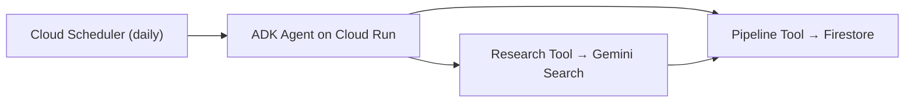

# ConvoSatya Lead Agent
 
An AI agent that finds and tracks real investors, accelerators, and startup events for ConvoSatya — running on its own, every day, on Google Cloud.
 
Built for the **All Things Agentic Hackathon** (Taskmaster category).
 
## Inspiration
 
While building ConvoSatya, we kept spending time searching for investors, accelerators, hackathons, demo nights, and other startup opportunities. We also had to track what we found and remember whom to follow up with. We wanted to build an agent that could handle this work automatically, every day.
 
## What it does
 
We built one AI agent on Google Cloud that:
 
- Runs automatically every day, with nobody triggering it
- Uses Gemini to search the web for investors, accelerators, hackathons, and startup programs
- Checks Firestore before saving anything, so the same lead is never added twice
- Saves each relevant opportunity with a short explanation of why it fits ConvoSatya
- Includes the original source links
- Marks leads where contact information still needs to be found manually
## How we built it
 
We used Python and Google's Agent Development Kit (ADK) to build one agent with two tools:
 
- A **research tool** that searches the web and evaluates opportunities
- A **Firestore tool** that checks for duplicates and saves new leads
Gemini returns results in a clear structure instead of one long paragraph. The agent runs on Cloud Run, and Cloud Scheduler starts it automatically every day. We use Google Cloud's built-in identity system, so there are no API keys stored anywhere in the code.
 

 
Full system diagram, sequence diagram, and Firestore schema are in [ARCHITECTURE.md](./ARCHITECTURE.md).
 
## Screenshots
 
**Cloud Run — the agent deployed and live**
 
<!-- add screenshot: cloud run service page -->
 
**Prompt: "Find leads for ConvoSatya"**
 
<!-- add screenshot: prompt and response -->
 
**Firestore — saved leads**
 
<!-- add screenshot: firestore -->
 
**List of leads**
 
<!-- add screenshot: list of leads -->
 
## Tech Stack
 
| Layer | Choice |
|---|---|
| Agent | Gemini 3.6 Flash + Google ADK |
| Backend | Python, ADK's built-in server |
| Data | Firestore (native mode) |
| Scheduling | Cloud Scheduler → Cloud Run |
| Hosting | Cloud Run |
| Auth | Application Default Credentials — no API keys stored anywhere |
 
Full breakdown in [Techstack.md](./Techstack.md).
 
## Quickstart
 
```bash
git clone https://github.com/ConvoSatya/convosatya-lead-agent.git
cd convosatya-lead-agent/backend/convosatya_agent
 
python -m venv venv
venv\Scripts\activate        # Windows
# source venv/bin/activate   # macOS/Linux
 
pip install -r requirements.txt
 
gcloud auth application-default login
gcloud config set project YOUR_PROJECT_ID
# Create a Firestore database (Native mode) in the Cloud Console first.
 
cd ..
adk run convosatya_agent
```
 
### Deploy to Cloud Run
 
```bash
adk deploy cloud_run \
  --project=YOUR_PROJECT_ID --region=us-central1 \
  --service_name=your-service-name --with_ui convosatya_agent -- \
  --set-env-vars GOOGLE_GENAI_USE_VERTEXAI=True,GOOGLE_CLOUD_PROJECT=YOUR_PROJECT_ID,GOOGLE_CLOUD_LOCATION=global \
  --allow-unauthenticated --min-instances=1
```
 
## Project Structure
 
```
convosatya-lead-agent/
├── README.md
├── SCOPE.md
├── Techstack.md
├── ARCHITECTURE.md
├── LICENSE
└── backend/
    └── convosatya_agent/
        ├── __init__.py
        ├── agent.py           # Root ADK agent + tool wiring
        ├── research_tool.py   # Discovery & Research (Gemini + search grounding)
        ├── pipeline_tool.py   # Firestore save + dedupe
        └── requirements.txt
```
 
## Scope
 
v1 focuses on finding and saving real opportunities automatically, every day, with no human involved after setup. Emailing leads and a dashboard are left for later, so we could ship a smaller system that actually works, reliably. LinkedIn automation is not included, since it goes against LinkedIn's terms — the agent only saves a public profile link for us to check manually. Full detail in [SCOPE.md](./SCOPE.md).
 
## Security
 
The agent logs in using Google Cloud's built-in identity system (Application Default Credentials) instead of API keys — so there's nothing secret stored in the code or the repo. `.env` files are excluded via `.gitignore` for local development regardless.
 
**Known limitation:** the Cloud Run service currently allows unauthenticated requests, to keep the daily scheduler simple within the hackathon timeline. Restricting this to Cloud Scheduler only is planned next.
 
## License
 
MIT — see [LICENSE](./LICENSE).
