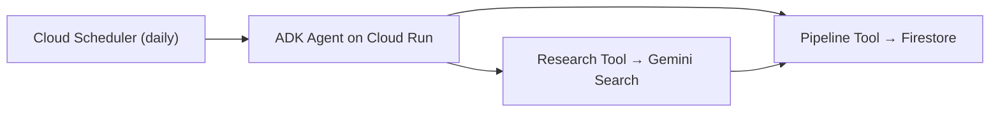

# ConvoSatya Lead & Opportunity Agent

An AI agent that discovers, researches, contacts, and follows up with
startup opportunities using Gemini, Google ADK, and Google Cloud — built
for the **All Things Agentic Hackathon** (Taskmaster category).

## The Problem

Manually researching investors, accelerators, hackathons, founder events,
and demo nights — then drafting outreach and tracking replies — is slow,
easy to lose track of, and doesn't scale for a solo founder. Opportunities
get missed simply because nobody was tracking them in one place.

## What It Does

This is **one Google ADK agent** with two tools, triggered either by
**Cloud Scheduler** on a daily schedule or by a direct API call — never
by manually entering a lead. Once triggered, the full cycle runs with no
human intervention:

- **Discovers** relevant investors, accelerators, hackathons, events, and
  startup programs using Gemini with live search grounding
- **Researches** each one and returns clean, structured data (name,
  category, why it's relevant, sources)
- **Checks Firestore first** so the same lead is never saved twice
- **Saves** every genuinely new lead to Firestore at stage **Found**,
  flagging `needs_manual_contact: true` when no public email was found
- **Runs autonomously in production** — deployed on Cloud Run, woken up
  daily by Cloud Scheduler with zero human involvement

Outreach (emailing leads) is a deliberate **v1 scope cut** — the founder
adds contact emails manually once a lead looks worth pursuing. See
[SCOPE.md](./SCOPE.md) for the full in-scope / out-of-scope breakdown.

## Architecture



Full system diagram, sequence diagram, and Firestore schema are in
[ARCHITECTURE.md](./ARCHITECTURE.md).

## Tech Stack

| Layer | Choice |
|---|---|
| Agent | Gemini 3.6 Flash + Google ADK |
| Backend | Python, ADK's built-in FastAPI server |
| Data | Firestore (native mode) |
| Scheduling | Cloud Scheduler → Cloud Run (direct HTTP trigger) |
| Hosting | Cloud Run |
| Auth | Vertex AI via Application Default Credentials — no API keys stored anywhere |
| Security | IAM service account, no secrets in code or repo |

Full breakdown in [Techstack.md](./Techstack.md).

## Demo

**Live agent:** https://convosatya-lead-agent-387676762246.us-central1.run.app

**Demo video:** _link added before final submission_

**Proof of autonomous operation:** a Cloud Scheduler job
(`daily-lead-discovery`) triggers this service once daily. A manual
"Force run" completed with status **Success**, and new, deduplicated
leads appeared in Firestore — with zero human interaction after the
schedule fired.

## Quickstart

```bash
git clone https://github.com/ConvoSatya/convosatya-lead-agent.git
cd convosatya-lead-agent/backend/convosatya_agent

python -m venv venv
venv\Scripts\activate        # Windows
# source venv/bin/activate   # macOS/Linux

pip install -r requirements.txt

gcloud auth application-default login
gcloud config set project YOUR_PROJECT_ID
# Create a Firestore database (Native mode) in the Cloud Console first.

cd ..
adk run convosatya_agent
```

### Deploy to Cloud Run

```bash
adk deploy cloud_run \
  --project=YOUR_PROJECT_ID --region=us-central1 \
  --service_name=your-service-name --with_ui convosatya_agent -- \
  --set-env-vars GOOGLE_GENAI_USE_VERTEXAI=True,GOOGLE_CLOUD_PROJECT=YOUR_PROJECT_ID,GOOGLE_CLOUD_LOCATION=global \
  --allow-unauthenticated --min-instances=1
```

## Project Structure

```
convosatya-lead-agent/
├── README.md
├── SCOPE.md
├── Techstack.md
├── ARCHITECTURE.md
├── LICENSE
└── backend/
    └── convosatya_agent/
        ├── __init__.py
        ├── agent.py           # Root ADK agent + tool wiring
        ├── research_tool.py   # Discovery & Research (Gemini + search grounding)
        ├── pipeline_tool.py   # Firestore save + dedupe
        └── requirements.txt
```

## Scope

v1 focuses on autonomous discovery and research for one founder
(ConvoSatya): finding real, relevant opportunities and saving them,
deduplicated, to Firestore — with zero human intervention after the
schedule fires. Outreach emailing and a dashboard UI are deliberately cut
from v1 to ship a smaller, fully-working core reliably. LinkedIn
automation is explicitly out of scope due to ToS risk. Full detail in
[SCOPE.md](./SCOPE.md).

## Security

The agent authenticates to Gemini and Firestore via Application Default
Credentials through its Cloud Run service account — **no API keys are
stored in code, `.env` files, or the repo at all**. `.env` is excluded
via `.gitignore` for local development regardless.

**Known limitation:** the Cloud Run service currently allows
unauthenticated invocations to simplify Cloud Scheduler integration
within the hackathon timeline. Restricting this to OIDC-authenticated
requests from Cloud Scheduler only is documented here as immediate
future work.

## License

MIT — see [LICENSE](./LICENSE).
